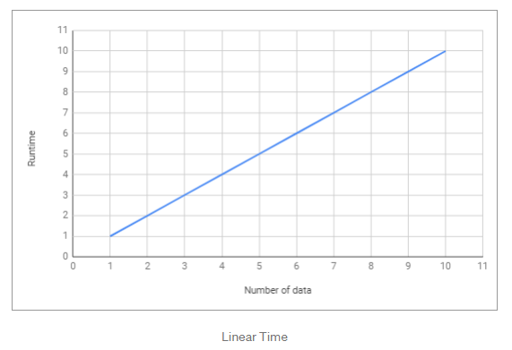
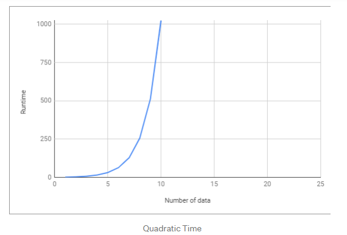
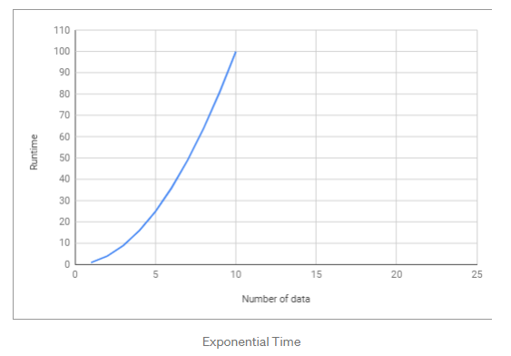

Nama :  Nurhaliza

NIM : 2110131120007

___

### TIME COMPLEXITY DAN BIG O NOTATION

Kompleksitas suatu algoritma dibagi menjadi 2, yaitu Time Complexity dan Space Complexity.

#### **A. Algoritma**

*Algorithm is a process or set of rules to be followed in calculations or other problem-solving operations, especially by a computer.*

Sederhananya, algoritma adalah serangkaian proses yang dilakukan secara berurutan untuk menyelesaikan sebuah permasalahan. Algoritma bisa bermacam-macam tergantung kepada siapa yang membuat algoritma tersebut. Permasalahannya adalah algoritma mana yang lebih efektif dan efisien?

Time Complexity Analysis adalah suatu cara sederhana untuk mengetahui berapa lama waktu yang dibutuhkan untuk menjalankan suatu algoritma dengan input tertentu (n). Biasanya lebih dikenal dengan sebutan Big-O Notation.

>Big O Notation digunakan untuk mengukur tingkat kompleksitas suatu algoritma.

#### **B. BIG O NOTATION**

Big-O Notation adalah cara untuk mengkonversi keseluruhan langkah-langkah suatu algoritma kedalam bentuk Aljabar, yaitu dengan menghiraukan konstanta yang lebih kecil dan koefisien yang tidak berdampak besar terhadap keseluruhan kompleksitas permasalahan yang diselesaikan oleh algoritma tersebut.

Contoh:
|Regular|Big O|
|---|---|
|2|O(1) - - > Hanya angka konstanta|
|2n + 10|O(n) - - > n memiliki efek terbesar|
|5n^2|O(n^2) - - > n^2 memiliki efek terbesar|

>kita hanya akan melihat faktor yang memiliki dampak paling besar terhadap nilai yang dihasilkan oleh algoritma tersebut

Terdapat beberapa macam time complexity:

1. O(1) - Constant Time

    Constant Time artinya banyaknya input yang diberikan kepada sebuah algoritma, tidak akan mempengaruhi waktu proses (runtime) dari algoritma tersebut.

        let myArray = [1, 5, 0, 6, 1, 9, 9, 2];
        function getFirst(input){
            return input[0]; // selalu melakukan 1 langkah
        }
        let firstEl = getFirst(myArray);

    jumlah input yang diberikan tidak mempengaruhi waktu proses (runtime) dari algoritma tersebut.

    

    <image src="image/1.PNG">
    

2. O(log n) — Logarithmic Time

    Logarithmic Time artinya ketika kita memberikan input sebesar n terhadap sebuah fungsi, jumlah tahapan yang dilakukan oleh fungsi tersebut berkurang berdasarkan suatu faktor. Salah satu contohnya adalah algoritma Binary Search. Binary search mengeleminasi setengah array input untuk mempercepat pencarian.

        let sortedArray = [11, 24, 30, 43, 51, 61, 73, 86];
        function isExists(number, array){
            var midPoint = Math.floor( array.length /2 );
            if( array[midPoint] === num) return true;
            let isFirstHalf = false;
            if( array[midPoint] < num ) isFirstHalf = true;
  
            else if( array[midpoint] > num ) isFirstHalf = false;
            if (array.length == 1) return false;
            else { 
                // memanggil fungsi yang sama dengan mengeleminiasi setengah dari input array
                    if (isFirstHalf) 
                        return isExists(number, getFirstHalf(array));
                    else 
                        return isExists(number, getSecondHalf(array));
                }
            }
            isExists (24, sortedArray); // return true
            isExists (27, sortedArray); // return false

3. O(n) — Linear Time

    Linear Time adalah ketika runtime dari fungsi kita berbanding lurus dengan jumlah input yang diberikan. Kita bisa melihat bahwa semakin banyak jumlah input yang diberikan, maka waktu proses/runtime dari fungsi tersebut akan semakin besar.

    

    
    

4. O(n²) — Quadratic Time

    Quadratic Time adalah ketika runtime dari fungsi kita adalah sebesar n^2, dimana n adalah jumlah input dari fungsi tersebut. Hal tersebut bisa terjadi karena kita menjalankan fungsi linear didalam fungsi linear (n*n).

    

    
    

5. O(2^n) — Exponential Time

    Exponential Time biasanya digunakan dalam situasi dimana kita tidak terlalu tahu terhadap permasalahan yang dihadapi, sehingga mengharuskan kita mencoba setiap kombinasi dan permutasi dari semua kemungkinan.

    

    
    
